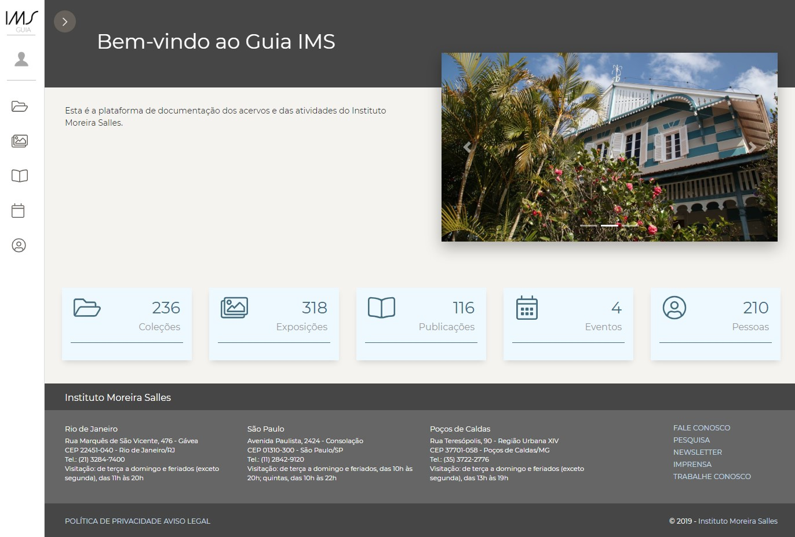

# Guia de Coleções

Sistema de gestão de acervos do Instituto Moreira Salles




## Tecnologias utilizadas
* Python (https://www.python.org)
* Django (https://www.djangoproject.com)
* PostgreSQL (https://www.postgresql.org)

## Documentação

Toda documentação a cerca deste projeto está disponível no diretório ```/docs```
