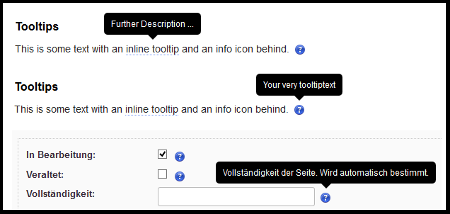

## Features List 1.0
** Legendas: **
* CRUD: Create, Read, Update, Disable;

----

### General Features
> Features gerais, com implicações transversais a diversas partes do sistema.

#### Logging Disable Data
- Toda manipulação de dados, para todos os modelos/métodos do sistema, deve ser feita em modo log, isto é, os dados não devem ser efetivamente apagados e sim desabilitados. Essa feature visa facilitar a auditoria de dados no sistema.

#### Upload Semântico de MediaFiles
- O sistema deve possuir engine para upload de arquivos (jpg, png, xls, xlsx csv, pdf, doc, docx, odt, ods), dependendo das classes que o pedirem;
- A organização de armazenamento destes files deve seguir uma lógica de diretórios semanticos. Ver exemplos abaixo:
  - Upload de imagem destaque de uma `Coleção`:

```
MEDIAFILEDIR / collections / collection_slug /
 timestamp_collection_slug_imagem-destaque.jpg

```

  * Upload de lista de obras utilizada numa `Edição` de uma `Exposição`:

```
MEDIAFILEDIR / exhibitions / expo_slug /
 timestamp_expo_ed_slug_lista-de-obras.pdf
```

#### Importação e Exportação em Lote (csv/xls)
- Os cadastros que deverão ter essa funcionalidade são: Eventos, Exposições, Publicações, Coleções, Contratos e Conjuntos;
- O sistema deve permitir exportação(output) de dados para todos os tipos de usuários, inclusive os públicos;
- O sistema deve permitir exportação(output) de dados a partir do resultado de uma busca (search result);
- O sistema deve permitir importação (input) de dados apenas aos usuários autorizados a edição/alteração de classes;
- O formato de importação/exportação deve ser csv / xls file;


#### Exportação de resultados em pdf
- Exportar relatório em `.pdf` sobre determinados resultados de uma busca (search result);


#### tool tip como recurso de interface
- Implementar tool tip na interface para ajudar na intuitividade do preenchimento de algumas infos;



### CRUD Class Features
> Ver documento de Class Models para maiores informações.


#### CRUD de USUÁRIOS - `User`
- Dado relacionados aos usuários que possuem login e senha no sistema;
- Via Django Admin, by superadmin;
- Implementar login via social network (gmail account);
- Implementar diferentes perfis de usuário (ver user roles specs);
- Correlação do dado com outros dados:
  - 1 `user` pode criar, editar e desabilitar de 0 até N registros de acordo com sua permissão;


#### CRUD de PESSOAS - `person`
- Dado relacionados a todo e qualquer pessoa que pode ser associada as classes-base da aplicação (tipologia de exemplo: autor, fotografo, artista, marchand);
- Via Django Admin e templates, by...;
- Correlação do dado com outros dados:
  - 1 `person` pode estar ligado a 0 ou N `item`, `group`, `collection`, `event`, `exhibition`, `contract`;


#### CRUD de CONTRATOS - `Contract`
- Dado relacionado a administração de contratos;
- Via Django Admin e templates, by... ;
- Correlação do dado com outros dados:
  - 1 `contract` pode estar ligado a 0 ou N `group`;
  - 1 `contract` pode estar ligado a 0 ou N `collection`;


#### CRUD de ESPAÇO e SUBESPAÇO - `space`, `subspace`
- Implementar classe para registros os espaços(sedes) do IMS (MG, RJ e SP);
- Implementar classe para registro dos subespaços viculados ao espaços-mãe (ex.: biblioteca é subespaço do espaço 'IMS Paulista');
- Via Django Admin, by superadmin;
- Vincular subespaços a classe `event` e `exhibition` para registro e recuperação de itinerancia de eventos e exposições;
- Correlação do dado com outros dados:
  - 1 `space` possui 0 a N `subspaces`;
  - 1 `subspace` pode estar ligado a 0 ou N `exhibition`;
  - 1 `subspace` pode estar ligado a 0 ou N `event`;


#### CRUD de EVENTOS - `Event`
- Dados relacionados aos eventos produzidos pela instituição dentro e fora de seus espaços-sede;
- Via Django Admin e templates, by ...; TODO: completar com perfil de usuários autorizado;
- Correlação do dado com outros dados:
  - 1 `event` pode ter 0 até N `exhibition`;
  - 1 `event` pode ter 0 até N `publication`


#### CRUD de EXPOSIÇÕES - `Exhibition`
- Dado relacionado as exposições ocorridas dentro e fora dos espaços e subespaços da instituição;
- Via Django Admin e templates, by...
- Correlação do dado com outros dados:
  - 1 `exhibition` pode ter 0 até N `event`;
  - 1 `exhibition` pode gerar 0 até N `publication`;
  - 1 `publication` pode estar vinculada a 0 ou N Exposições;
- Na tela de uma Exposição, criar um box para demonstração de itinerancia desta, exibindo assim a sequência de edições desta exposição. Ver exemplo abaixo;

|`Maison Européenne de la Photographie`|
|--|--|--|
|01.03.2018 a 30.03.2018|01.04.2018 a 30.04.2018|01.05.2018 a 30.05.2018
|IMS Paulista (Galeria 2)|IMS Rio (Casa)|IMS Poços de Caldas|

#### CRUD de PUBLICAÇÕES - `Publication`
- Dado relativo as publicações editadas pela instituição (ver documento de classe para a definição de publicação);
- Via Django Admin e templates, by...
- Correlação do dado com outros dados:
  - 1 `publication` pode ser relativa a 0 ou N `exhibition`;
  - 1 `publication` pode ser relativa a 0 ou N `event`;
  - 1 `publication` pode ser relativa a 0 ou N `collection`;

#### CRUD de CONJUNTOS de COLEÇÕES

#### CRUD de COLEÇÕES - `Collection`

- Criar coleções, de n conjuntos e criar relações com exposições, publicações, pessoas e entradas patrimoniais (lotes);


## Report Graphical Features
> Funcionalidades relativas aos relatórios gráficos gerados pela plataforma

TODO:
  - Definir métricas simples para visualizar a produção da equipe de acervo;


5. Outros

* Definir um Modelo de Dados desejável, elencando os principais dados que devem constar nas visualizações do guia. Este modelo é o desenho e a seleção de dados já presentes no sistema de gestão de acervos;
* Documento descritivo com de definição de ACESSOS E PERMISSÕES (User roles);
* Documento descritivo com CASOS DE USO, descrevendo funções do sistema como criação e edição de coleções, importação de dados, tipos de relatórios, etc;

----

## Features List 2.0

#### CRUD de ITEM do acervo
  - Todo item deve conter uma página de exibição própria;
  - Toda página do item exibe Itens relacionados a este;
  - Considerar a relação de Itens com a mesma informação em diferentes suportes, frequentemente relacionando uma matriz com diversas reproduções. Essa informação pode aparecer como uma listagem de `Itens relacionados` na página de detalhe.

**Exemplos**
- `Negativo` e suas diversas reproduções _vintages_ e posteriores;
- `Fonograma` presente em diversos discos;
