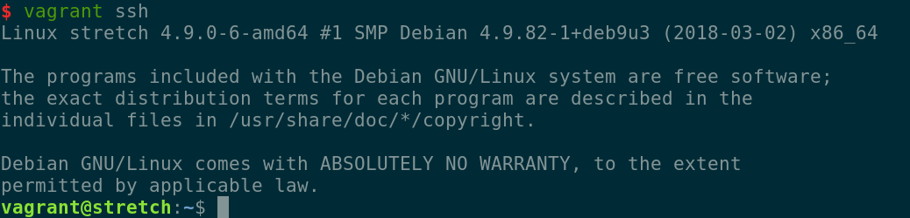

# Catalogue Collections

# Requirements
* Python 3.5 >= (https://www.python.org)
* Django 2.0 >= (https://www.djangoproject.com)
* Django Rest Framework 3.0 >= (http://www.django-rest-framework.org)
* PostgreSQL 9.6 >= (https://www.postgresql.org)


## Dev Enviroment Deploy

#### 1. Instale o vagrant
  * https://www.vagrantup.com

#### 2. Crie um diretório para o projeto.
Se estiver usando linux, faça:
```
$ mkdir 2018_debian9_django_cataloguecollections
$ cd 2018_debian9_django_cataloguecollections
```

#### 3. Instale um S.O. virtualizado (recomentação: Debian 9 ou Ubuntu 16.04)
```
$ vagrant init debian/stretch64
$ vagrant up
```

#### 4. Logue na máquina
```
$ vagrant ssh
```
Você verá uma tela assim:


para virar root:
```
$ sudo su
```

#### 5. Crie o usuário da aplicação no servidor

Sugerimos que o usuário usado para fazer a instalação não seja o root. Aqui, o usuário que está fazendo a instalação é o **cataloguecollections**. Assim, nos comandos abaixo, substitua o nome do usuário pelo que você estiver usando. Os scripts possuem uma variável para definir o usuário que executará o proxy (wsgi). Caso use um usuário diferente, olhe o arquivo Makefile e faça as alterações necessárias.

Este passo-a-passo pressupões que você esteja logado com o usuário cataloguecollections, que ele esteja no grupo sudo.

É possível verificar se o usuário **cataloguecollections** existe através do comando:
```
root@server# grep cataloguecollections /etc/passwd
```

Caso o usuário exista, o comando acima deve retornar uma linha semelhante a seguinte:
```
cataloguecollections:x:999:999::/home/cataloguecollections:
```
Caso não exista é possível criá-lo com:

```
# useradd --groups sudo --create-home cataloguecollections
```
Depois mude a senha caso não se lembre:

```
root@server# passwd cataloguecollections
```

#### 6. Dependencias externas

##### 6.1 Instale Python3, faça o preset como versão padrão e instale o virtualenv
```
# apt update
# apt install python3 build-essential python-dev gettext python-virtualenv
# echo "alias python=python3" >> ~/.bashrc
```
verifique se possui o pip instalado:
```
$ pip --version
```
Instalação: https://pip.pypa.io/en/stable/installing/

Instale o virtualenv
```
# pip install virtualenv
```

##### 6.2 Instale o GIT
```
# apt-get install git
```

##### 6.3 Instale o PostgreSQL
Recomendamos o postgreSQL, mas o django suporta outros bancos de dados relacionais.
```
# apt install postgresql
```

##### 6.4 Crie o banco de dados:

```
# sudo su - postgres -c "createuser -d cataloguecollections"
```

Com usuário da aplicação - logado como **cataloguecollections** - crie a base de dados

```
$ createdb --encoding "UTF-8" cataloguecollections
```

#### 7. Dependencias internas

Crie o env:

```
$ virtualenv env
```

Ative o env:
```
$ source env/bin/activate
```

##### 6.1 Instale o django
Esse comando deve ser dado com env ativado e sem sudo. Se for exigido root, há problema na identificação de enviroment. Isso pode ser corrigido mudando o path do env.

```
$ pip install django
```

#### 7. Banco de dados
Provisione um banco para aplicação

```
$ sudo su - postgres
```
Veja o prompt:
```
postgres@myuser:~$
```
Crie o Banco
```
$ createdb mydb
```


* Crie a base:
```
$ python3.5 manage.py migrate
```

## Atalhos

### Rodando a aplicação localmente
1. Ative o env
2. Rode o runserver
```
$ python3.5 manage.py runserver
```


### References
* UWSGI
  * https://docs.djangoproject.com/pt-br/2.0/howto/deployment/wsgi/uwsgi/
